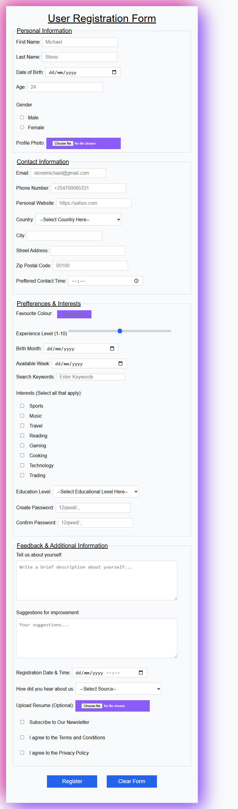

<h3 align="center"><strong>Building Forms With Semantic HTML</strong></h3>

  <p align="center">
    Implementing semantic html to enhance form functionality.
    <br />
    </p>
</div>

### Built With

* HTML with Semantic Structure.

<!-- GETTING STARTED -->
## Getting Started

This is a document exlpaining the 'how to' in implementing a structured HTML form demonstrating best semantic HTML practices. 

You will learn how to create a functional HTML implementation of a 'User registration form' using semantic HTML structure.


 
1. First Phase. This begins our HTML framework. We need this at the beginning of every HTML document we work on for better functionality.  

```
<!doctype html>
<html lang="en">
  <head>
    <meta charset="UTF-8" />
    <meta name="viewport" content="width=device-width, initial-scale=1.0" />
    <title>Registration-Form</title>
    <link rel="stylesheet" href="styles.css">
  </head>
  <body>
    <header>
      <legend id="legend1">User Registration Form</legend>
    </header>

```

2. Now we dive into the meat of our HTML document. The 'main' semantic tag is the portion of this document that the User will interact     with.
   Here we divide the the Form into 'section'- 4 sections to be exact. This lets us interact with the document in 3 parts and makes it     much easier to debug, edit and run.
    <ul>
      <li>Section- Personal Information</li>
      <li>Section- Contact Information</li>
      <li>Section- Preferences and Interests</li>
      <li>Section- Feedback and Additional Information</li>
    </ul>
</li>
   
```
<!doctype html>
<html lang="en">
  <head>
    <meta charset="UTF-8" />
    <meta name="viewport" content="width=device-width, initial-scale=1.0" />
    <title>Registration-Form</title>
    <link rel="stylesheet" href="styles.css">
  </head>
  <body>
    <header>
      <legend id="legend1">User Registration Form</legend>
    </header>
    <main>
      <form action="submit_form.php" method="POST" enctype="multipart/form-data" autocomplete="on">
        <fieldset>
          <legend>Personal Information</legend>    
          <label for="first-name">First Name:</label>
          <input
            type="text"
            id="first-name"
            name="first-name"
            placeholder="Michael"
            autocomplete="given-name"
            required
          /><br /><br />

          <label for="last-name">Last Name:</label>
          <input
            type="text"
            id="last-name"
            name="last-name"
            placeholder="Stone"
            autocomplete="family-name"
            required
          /><br /><br />

          <label for="date-birth">Date of Birth:</label>
          <input type="date" id="date-birth" name="date-birth" autocomplete="date-birth" required /><br /><br />

          <label for="age">Age:</label>
          <input
            type="text"
            id="age"
            name="age"
            placeholder="24"
            required
          /><br /><br />

          <p>Gender</p>
          <label for="male">
          <input type="radio" id="male" name="gender" value="male" />Male</label
          ><br />
          <label for="female"
            ><input type="radio" id="female" name="gender" value="female" />Female</label
          ><br /><br />

          <label for="fileInput" class="Upload">Profile Photo:</label>
          <input
            type="file"
            id="fileInput"
            accept="image/*"
            onchange="previewImage(event)"
          />
        </fieldset>

        <fieldset>
          <legend>Contact Information</legend>
          <label for="email">Email:</label>
          <input
            type="email"
            id="email"
            name="email"
            placeholder="stonemichael@gmail.com"
            autocomplete="email"
            required
          /><br /><br />

          <label for="phone-number">Phone Number:</label>
          <input
            type="tel"
            id="phone-number"
            name="phone-number"
            placeholder="+254700065331"
            autocomplete="tel"
            required
          /><br /><br />

          <label for="website">Personal Website:</label>
          <input
            type="text"
            id="website"
            name="website"
            placeholder="https://yahoo.com"
            autocomplete="url"
          /><br /><br />

          <label for="country">Country:</label>
          <select id="country" name="country" autocomplete="country-name" required>
            <option value="select">--Select Country Here--</option>
            <option value="kenya">Kenya</option>
            <option value="usa">USA</option>
            <option value="canada">Canada</option>
            <option value="uk">UK</option>
            <option value="australia">Australia</option>
            <option value="india">India</option>
            <option value="uganda">Uganda</option>
            <option value="tanzania">Tanzania</option>
            <option value="rwanda">Rwanda</option>
            <option value="south africa">South Africa</option>
            <option value="nigeria">Nigeria</option></select
          ><br /><br />

          <label for="city">City:</label>
          <input type="text" id="city" name="city" autocomplete="address-level2" /><br /><br />

          <label for="address">Street Address: </label>
          <input type="text" id="address" name="address" autocomplete="street-address" /><br /><br />

          <label for="zip-code">Zip Postal Code:</label>
          <input type="text" id="zip-code" name="zip-code" placeholder="00100" autocomplete="postal-code" />
          
          <br /><br />

          <label for="contact-time">Preffered Contact Time:</label>
          <input type="time" id="contact-time" name="contact-time" required />
          <br /><br />
        </fieldset>

        <fieldset>
          <legend>Prefferences & Interests</legend>
          <label for="color">Favourite Colour:</label>
          <input type="color" id="color" value="#8b5cf6" /><br /><br />

          <label for="number">Experience Level (1-10)</label>
          <input type="range" id="number" min="0" max="10" step="1" value="5" />
          
          <br /><br />

          <label for="birth">Birth Month:</label>
          <input type="date" id="birth" name="birth" /><br /><br />

          <label for="date-week">Available Week:</label>
          <input type="date" id="date-week" name="date-week" /><br /><br />

          <label for="search">Search Keywords:</label>
          <input type="search" id="search" name="search" placeholder="Enter Keywords" />
          
          <br /><br />

          <p>Interests (Select all that apply):</p>
          <input type="checkbox" id="sports" name="interests" value="sports" />
          <label for="sports">Sports</label><br />
          <input type="checkbox" id="music" name="interests" value="music" />
          <label for="music">Music</label><br />
          <input type="checkbox" id="travel" name="interests" value="travel" />
          <label for="travel">Travel</label><br />
          <input type="checkbox" id="reading" name="interests" value="reading" />
          <label for="reading">Reading</label><br />
          <input type="checkbox" id="gaming" name="interests" value="gaming" />
          <label for="gaming">Gaming</label><br />
          <input type="checkbox" id="cooking" name="interests" value="cooking" />
          <label for="cooking">Cooking</label><br />
          <input type="checkbox" id="technology" name="interests" value="technology" />
          <label for="technology">Technology</label><br />
          <input type="checkbox" id="trading" name="interests" value="trading" />
          <label for="trading">Trading</label><br /><br />

          <label for="label">Education Level:</label>
          <select id="label" name="label" required>
            <option value="select">--Select Educational Level Here--</option>
            <option value="primary">Primary</option>
            <option value="high school">High School</option>
            <option value="course">Technical Course</option>
            <option value="diploma">Diploma</option>
            <option value="bachelors">Bachelors</option>
            <option value="masters">Masters</option>
            <option value="phd">PhD</option></select
          ><br /><br />

          <label for="pwd">Create Password:</label>
          <input
            type="password"
            id="pwd"
            name="pwd"
            placeholder="12qwed/.,"
            autocomplete="new-password"
            required
          /><br /><br />
          <label for="confirm">Confirm Password:</label>
          <input
            type="password"
            id="confirm"
            name="confirm"
            placeholder="12qwed/.,"
            autocomplete="new-password"
            required
          /><br /><br />
        </fieldset>

        <fieldset>
          <legend>Feedback & Additional Information</legend>
          <label for="bio">Tell us about yourself:</label><br />
          <textarea
            id="bio"
            name="bio"
            rows="5"
            cols="50"
            placeholder="Write a brief description about yourself..."
          ></textarea
          ><br /><br />

          <label for="Information">Suggestions for improvement:</label><br />
          <textarea
            id="Information"
            name="Information"
            rows="5"
            cols="50"
            placeholder="Your suggestions..."
          ></textarea
          ><br /><br />

          <label for="date-register">Registration Date & Time:</label>
          <input type="datetime-local" id="date-register" name="date-register" /><br /><br />

          <label for="input">How did you hear about us:</label>
          <select name="input" id="input">
            <option value="select">--Select Source--</option>
            <option value="friends">Friends & Family</option>
            <option value="social media">Social Media</option>
            <option value="posters">Posters</option>
            <option value="online ads">Online Ads</option>
            <br /><br /></select
          ><br /><br />

          <label for="resume">Upload Resume (Optional):</label>
          <input type="file" id="resume" accept=".pdf,.doc,.docx" /><br /><br />

          <input type="checkbox" id="subscribe" name="subscribe" />
          <label for="subscribe">Subscribe to Our Newsletter</label><br /><br />

          <input type="checkbox" id="terms" name="terms" required />
          <label for="terms">I agree to the Terms and Conditions</label
          ><br /><br />

          <input type="checkbox" id="privacy" name="privacy" required />
          <label for="privacy">I agree to the Privacy Policy</label><br /><br />

        </fieldset>

        <footer>
          <button name="one" value="register">Register</button>
          <button name="two" value="clear">Clear Form</button>
        </footer>
      </form>
    </main>
  </body>
</html>

```

3. 'Section' - Personal Information.<br>
   This is a submit form because the user will fill in data and 'submit' it. That is why we use _'method="post"_. Each and every _label_
   is followed by _input_.<br>
   
   The _'label'_ element in HTML is used to define a label for form elements like <strong>  text fields, checkboxes, radio buttons,        etc</strong>. It enhances accessibility by linking descriptive text to form controls, making it easier for users (especially those      using assistive technologies) to interact with forms.<br>
   
   The _'input'_ tag in HTML is a versatile element used to create interactive controls for web forms, allowing users to input data. It      supports a variety of input types and attributes to customize its behavior. Throughout this document we use different types of input    types namely: text, password, email, number, checkbox, radio (button), range, file (upload) and submit (button). This is followed bt    a set of attributes which adds certain fuctions e.g
     <ul>
        <li>name: Identifies the input field.</li>
        <li>placeholder: Displays a hint inside the input field.</li>
        <li>value: Sets a default value.</li>
        <li>required: Makes the field mandatory.</li>
        <li>disabled: Disables the input field.</li>
        <li>readonly: Makes the field read-only.</li>
     </ul>
 
 
   ```
        <fieldset>
          <legend>Personal Information</legend>    
          <label for="first-name">First Name:</label>
          <input
            type="text"
            id="first-name"
            name="first-name"
            placeholder="Michael"
            autocomplete="given-name"
            required
          /><br /><br />

          <label for="last-name">Last Name:</label>
          <input
            type="text"
            id="last-name"
            name="last-name"
            placeholder="Stone"
            autocomplete="family-name"
            required
          /><br /><br />

          <label for="date-birth">Date of Birth:</label>
          <input type="date" id="date-birth" name="date-birth" autocomplete="date-birth" required /><br /><br />

          <label for="age">Age:</label>
          <input
            type="text"
            id="age"
            name="age"
            placeholder="24"
            required
          /><br /><br />

          <p>Gender</p>
          <label for="male">
          <input type="radio" id="male" name="gender" value="male" />Male</label
          ><br />
          <label for="female"
            ><input type="radio" id="female" name="gender" value="female" />Female</label
          ><br /><br />

          <label for="fileInput" class="Upload">Profile Photo:</label>
          <input
            type="file"
            id="fileInput"
            accept="image/*"
            onchange="previewImage(event)"
          />
        </fieldset>


      ```


4. Section: Contact Information.<br>
   Here we introduce a dropdown option by using the 'select' element. The _'select'_ element in HTML is used to create a drop-down menu    that allows users to select one or more options. It is commonly used in forms for user input. <br>

   <strong>Key Points</strong><br>
   <ul>
      <li>'select': Defines the drop-down menu.</li>
      <li>'option': Represents each item in the menu.</li>
  </ul><br>

  <strong>Attributes</strong>:<br>
  <ul>
      <li>name: Identifies the drop-down for form submission.</li>
      <li>value: Specifies the value sent to the server when an option is selected.</li>
      <li>selected: Pre-selects an option by default.</li>
      <li>multiple: Allows selecting multiple options.</li>
    </ul>

      
```
        <fieldset>
          <legend>Contact Information</legend>
          <label for="email">Email:</label>
          <input
            type="email"
            id="email"
            name="email"
            placeholder="stonemichael@gmail.com"
            autocomplete="email"
            required
          /><br /><br />

          <label for="phone-number">Phone Number:</label>
          <input
            type="tel"
            id="phone-number"
            name="phone-number"
            placeholder="+254700065331"
            autocomplete="tel"
            required
          /><br /><br />

          <label for="website">Personal Website:</label>
          <input
            type="text"
            id="website"
            name="website"
            placeholder="https://yahoo.com"
            autocomplete="url"
          /><br /><br />

          <label for="country">Country:</label>
          <select id="country" name="country" autocomplete="country-name" required>
            <option value="select">--Select Country Here--</option>
            <option value="kenya">Kenya</option>
            <option value="usa">USA</option>
            <option value="canada">Canada</option>
            <option value="uk">UK</option>
            <option value="australia">Australia</option>
            <option value="india">India</option>
            <option value="uganda">Uganda</option>
            <option value="tanzania">Tanzania</option>
            <option value="rwanda">Rwanda</option>
            <option value="south africa">South Africa</option>
            <option value="nigeria">Nigeria</option></select
          ><br /><br />

          <label for="city">City:</label>
          <input type="text" id="city" name="city" autocomplete="address-level2" /><br /><br />

          <label for="address">Street Address: </label>
          <input type="text" id="address" name="address" autocomplete="street-address" /><br /><br />

          <label for="zip-code">Zip Postal Code:</label>
          <input type="text" id="zip-code" name="zip-code" placeholder="00100" autocomplete="postal-code" />
          
          <br /><br />

          <label for="contact-time">Preffered Contact Time:</label>
          <input type="time" id="contact-time" name="contact-time" required />
          <br /><br />
        </fieldset>


```

<br>


5.  Fieldset: Preferences and Interests.


```
        <fieldset>
          <legend>Prefferences & Interests</legend>
          <label for="color">Favourite Colour:</label>
          <input type="color" id="color" value="#8b5cf6" /><br /><br />

          <label for="number">Experience Level (1-10)</label>
          <input type="range" id="number" min="0" max="10" step="1" value="5" />
          
          <br /><br />

          <label for="birth">Birth Month:</label>
          <input type="date" id="birth" name="birth" /><br /><br />

          <label for="date-week">Available Week:</label>
          <input type="date" id="date-week" name="date-week" /><br /><br />

          <label for="search">Search Keywords:</label>
          <input type="search" id="search" name="search" placeholder="Enter Keywords" />
          
          <br /><br />

          <p>Interests (Select all that apply):</p>
          <input type="checkbox" id="sports" name="interests" value="sports" />
          <label for="sports">Sports</label><br />
          <input type="checkbox" id="music" name="interests" value="music" />
          <label for="music">Music</label><br />
          <input type="checkbox" id="travel" name="interests" value="travel" />
          <label for="travel">Travel</label><br />
          <input type="checkbox" id="reading" name="interests" value="reading" />
          <label for="reading">Reading</label><br />
          <input type="checkbox" id="gaming" name="interests" value="gaming" />
          <label for="gaming">Gaming</label><br />
          <input type="checkbox" id="cooking" name="interests" value="cooking" />
          <label for="cooking">Cooking</label><br />
          <input type="checkbox" id="technology" name="interests" value="technology" />
          <label for="technology">Technology</label><br />
          <input type="checkbox" id="trading" name="interests" value="trading" />
          <label for="trading">Trading</label><br /><br />

          <label for="label">Education Level:</label>
          <select id="label" name="label" required>
            <option value="select">--Select Educational Level Here--</option>
            <option value="primary">Primary</option>
            <option value="high school">High School</option>
            <option value="course">Technical Course</option>
            <option value="diploma">Diploma</option>
            <option value="bachelors">Bachelors</option>
            <option value="masters">Masters</option>
            <option value="phd">PhD</option></select
          ><br /><br />

          <label for="pwd">Create Password:</label>
          <input
            type="password"
            id="pwd"
            name="pwd"
            placeholder="12qwed/.,"
            autocomplete="new-password"
            required
          /><br /><br />
          <label for="confirm">Confirm Password:</label>
          <input
            type="password"
            id="confirm"
            name="confirm"
            placeholder="12qwed/.,"
            autocomplete="new-password"
            required
          /><br /><br />
        </fieldset>

  

```
<br>


6. Fieldset: Feedback and Additional Information.


```
<fieldset>
  <legend>Feedback & Additional Information</legend>
  <label for="bio">Tell us about yourself:</label><br />
  <textarea  id="bio" name="bio"  rows="5"  cols="50"       placeholder="Write a brief description about yourself..."  ><textarea>
  <br /><br />

  <label for="Information">Suggestions for improvement:</label><br />
  <textarea  id="Information"  name="Information"  rows="5"  cols="50"  placeholder="Your suggestions..."  ></textarea>
  <br /><br />

  <label for="date-register">Registration Date & Time:</label>
  <input type="datetime-local" id="date-register"  name="date-register" />
  <br /><br />

  <label for="input">How did you hear about us:</label>
  <select name="input" id="input">
    <option value="select">--Select Source--</option>
    <option value="friends">Friends & Family</option>
    <option value="social media">Social Media</option>
    <option value="posters">Posters</option>
    <option value="online ads">Online Ads</option>
    <br /><br />
  </select>
  <br /><br />

  <label for="resume">Upload Resume (Optional):</label>
  <input type="file" id="resume" accept=".pdf,.doc,.docx" />
  <br><br />

  <input type="checkbox" id="subscribe" name="subscribe" />
  <label for="subscribe">Subscribe to Our Newsletter</label>
  <br /><br />

  <input type="checkbox" id="terms" name="terms" required />
  <label for="terms">I agree to the Terms and Conditions</label>
  <br /><br />

  <input type="checkbox" id="privacy" name="privacy" required />
  <label for="privacy">I agree to the Privacy Policy</label><br /><br />

</fieldset>


```
<br>


7. Adding a 'footer' tag to close the form. The _'button'_ is used to create interactive and clickable buttons on a webpage. These
buttons can perform various actions enhancing user interaction.


```

 <footer>
    <button name="one" value="register">Register</button>
    <button name="two" value="clear">Clear Form</button>
 </footer>

```


# Form Styling with CSS Variables

This project demonstrates professional **CSS form styling** using **custom properties (variables)** for a scalable, maintainable, and consistent color system.  
The design focuses on readability, accessibility, and clean visual hierarchy using shadows, borders, and modern color combinations.

---

## CSS Implementation Notes

The CSS applies best practices including:

- Use of **CSS custom properties (`--variable-name`)** for global color management  
- Consistent **spacing**, **font hierarchy**, and **alignment**  
- Responsive input widths and accessible contrast  
- Smooth **hover transitions** and **button interactivity**  
- Modular, maintainable code organized by element type

---

## Color Palette Documentation

| Variable | Description | Hex Value | Usage |
|-----------|--------------|-----------|--------|
| `--color-bg` | Background color | `#f9fafb` | Body background |
| `--color-border` | Border color | `#d1d5db` | Inputs, sections, general borders |
| `--color-text-muted` | Muted text color | `#6b7280` | Footer text, hover text |
| `--color-primary` | Main blue | `#2563eb` | Buttons |
| `--color-primary-light` | Light blue hover | `#3b82f6` | Button hover (variant 1) |
| `--color-primary-dark` | Deep blue hover | `#1e40af` | Button hover (variant 2) |
| `--color-accent-violet` | Violet accent | `#8b5cf6` | File input, color picker |
| `--color-accent-pink` | Pink accent | `#ec4899` | Shadow highlight |
| `--shadow-primary` | Dual shadow | Uses violet & pink | Container shadow |

All colors were chosen to create a **balanced, modern look** with strong contrast and visual appeal.

---

##  Design Decisions Explanation

###  Color System
- Soft neutral background (`#f9fafb`) for readability  
- Blue tones symbolize **trust and professionalism**  
- Violet-pink shadows add **depth and creativity**

###  Layout
- Centered container with `max-width: 600px` for focus  
- Consistent spacing and border application  
- Subtle **box shadows** to elevate form visuals

###  Typography
- **Arial, sans-serif** for clean readability  
- Hierarchical font sizes for headings (`h1`, `h4`) and inputs  

###  Interactions
- Buttons change color smoothly on hover  
- Inputs have clear focus areas and accessible contrast  

---


##  Styling Approach

This project follows a **modular CSS methodology** with:
- Reusable **CSS variables** defined under `:root`  
- Logical grouping of selectors (inputs, buttons, sections, etc.)  
- **Separation of concerns**: structure in HTML, presentation in CSS  
- Responsive sizing using `%` and `px` units  
- Focus on clarity, simplicity, and consistency

**Technologies used:**
- Pure CSS3 (no frameworks)
- CSS Variables (`:root`)
- Modern transitions and hover effects

---

##  Features Implemented

-  CSS Custom Properties for color theming  
-  Dual-tone **box shadows** with violet & pink  
-  Smooth **hover transitions** for interactive elements  
-  Consistent **border and spacing** across inputs  
-  Styled input types (`text`, `email`, `color`, `file`, etc.)  
-  Responsive form container with maximum width  
-  Simple, professional visual structure

---

##  Browser Compatibility

This stylesheet uses only widely supported CSS features.

| Browser | Compatibility |
|----------|---------------|
| 🟢 Chrome | ✅ Fully supported |
| 🟣 Firefox | ✅ Fully supported |
| 🔵 Edge | ✅ Fully supported |
| 🍎 Safari | ✅ Fully supported |

No vendor prefixes required — all features conform to the CSS3 standard.

---

##  Screenshots and Form Description



### Description
The styled form presents a **light, minimalist interface** with vibrant accent shadows.  
All input types are consistently styled, ensuring a uniform look and feel.  
Buttons feature engaging hover effects, and the overall form maintains a **professional and accessible aesthetic**.

---


<!-- USAGE EXAMPLES -->
## Usage

With semantic structure in your HTML code you can easily design any form. Semantic tags like 'header', 'main', 'section', and 'article' explicitly define the role of content blocks.
Benefits:
<ul>
     <li>SEO: Search engines crawl and index more effectively when content is structured semantically.</li>
     <li>Accessibility: Screen readers and assistive technologies interpret semantic HTML to improve navigation.</li>
     <li>Maintainability: Developers can write cleaner, more structured, and reusable code.</li>
</ul>

<!-- CONTRIBUTING -->
## Contributing

Contributions are what make the open source community such an amazing place to learn, inspire, and create. Any contributions you make are **greatly appreciated**.

If you have a suggestion that would make this better, please fork the repo and create a pull request. You can also simply open an issue with the tag "enhancement".
Don't forget to give the project a star! Thanks again!

1. Fork the Project
2. Create your Feature Branch (`git checkout -b feature/AmazingFeature`)
3. Commit your Changes (`git commit -m 'Add some AmazingFeature'`)
4. Push to the Branch (`git push origin feature/AmazingFeature`)
5. Open a Pull Request


<!-- CONTACT -->
## Contact

### Author
**Carlos Kimuyu**  
Programming Student | Passionate about Clean Design and Modern Web Development 

X Handle: [@KimuyuCarlos](https://twitter.com/@KimuyuCarlos) 

Gmail: kimuyuboh@gmail.com

Project Link: [https://github.com/kimuyuboh-blip/Forms.git](https://github.com/kimuyuboh-blip/Forms.git)

